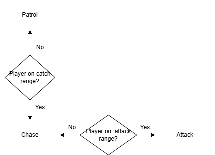
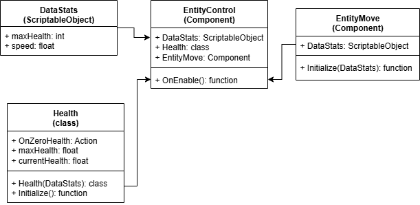
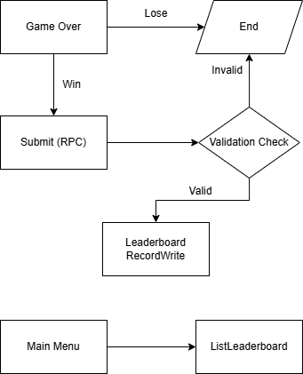
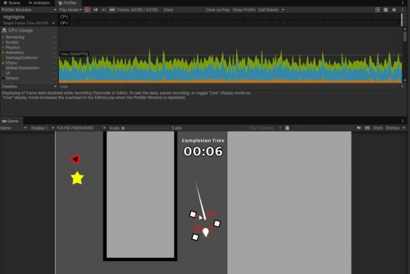
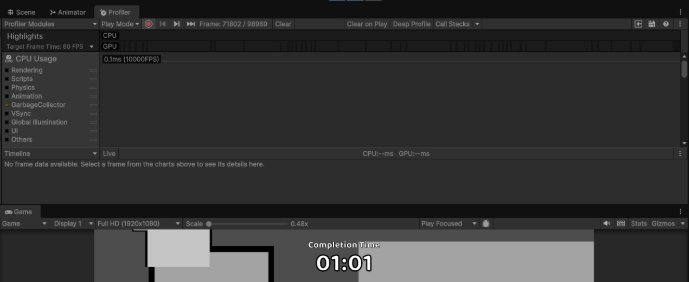

**README:** 

- **Video Showcase** 

  <https://youtu.be/gubyeDgfuJM>

**Versions** 

  Unity 60000.52f1 LTS Nakama SDK 3.15.0 

**Docker compose steps** 
- Open Terminal on nakama/typescript-project directory 
- Run docker compose up --build  

**Controls** 
- Move: WASD 
- Dash: Space 
- Cheats are button click to activate 

**Enemy States** 

  

**Data flow** 

  

**Leaderboard flow** 

  

**Known issues and trade-offs** 
- Player position is not reset on game over. The next game will start from where you left off
- Enemies cannot move around obstacles. They may get stuck if something is in their way 

**Profiler** 

  

  

. 